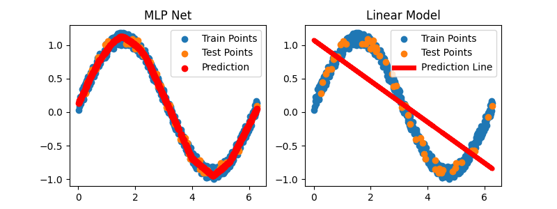
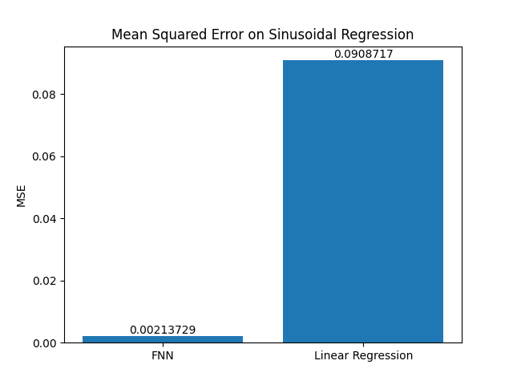
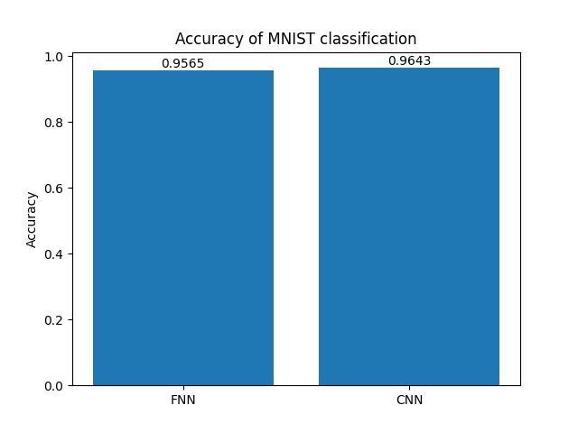
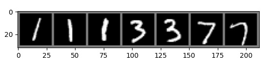

# Neural Network Modeling
This code explores the capabilities of neural network on regression and classification tasks.
For regression, points (x,y) were sampled from the sine curve, and noise, sampled from Unif(0, 0.2), was added to y. The code implements a 2-layer Feedforward Neural Network (FNN) and a linear regression model. Both models were evaluated with mean squared error on a held-out test set. The FNN with hidden dimension = 90, number of epochs = 5000, learn rate = 0.1, and momentum = 0.9 achieved a mean squared error of 0.00214 outperforming the linear model whose mean squared error was 0.0909. The following are the comparisons of regression by FNN and linear model on the sinusoidal data and their mean-squared errors.

(Change the image from MLP to FNN)

Next, the code compares the performance of FNN and Convoluational Neural Network on MNIST classification. With hidden dimension = 50, number of epochs = 40, learn rate = 0.01, momentum = 0.9, FNN's accuracy on the test set was 0.9565. Similarly, with hidden channels = 20, number of epochs = 40, learn rate = 0.001, momentum = 0.9, CNN's accuracy was 0.9643. 

As an example, for the following digits, FNN and CNN both classify the digits as 1, 1, 1, 3, 3, 7, 7. 

Although FNN and CNN have comparable accuracies, the number of parameters in the FNN was 39760 while that in CNN was 13590. This is almost 3-fold difference. This suggests that when scaled to data larger than simple 28 x 28 images, the computing demand of FNN may be significantly greater than that of CNN. 